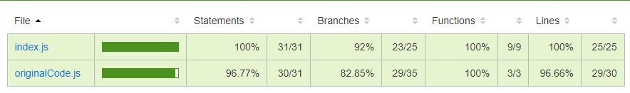

# Gilded Rose Refactoring Kata

Bordeaux Ynov M1 - Architecture Logicielle

## Kata: [here](https://github.com/emilybache/GildedRose-Refactoring-Kata)

### Clarifications: 

"Feel free to make any changes to the UpdateQuality method and add any new code as long as everything
still works correctly. However, do not alter the Item class or Items property as those belong to the
goblin in the corner who will insta-rage and one-shot you as he doesn't believe in shared code
ownership (you can make the UpdateQuality method and Items property static if you like, we'll cover
for you).

Just for clarification, an item can never have its Quality increase above 50, however "Sulfuras" is a
legendary item and as such its Quality is 80 and it never alters."

# Refactoring : Steps

## Step 1: Setup

### Modifications 

I modified the original ES5 syntax to use ES6.
To do so, I installed and configured Babel.

### Workflow

Added Github Action workflow to open PR on dev branch push.

### Sanity test

Wrote and ran a sanity test to make sure Jest is working properly.

## Step 2: Write tests based on the requirements

System: 
- All items have a SellIn value which denotes the number of days we have to sell the item
- All items have a Quality value which denotes how valuable the item is
- At the end of each day our system lowers both values for every item

Requirements: [Full Specifications](https://github.com/emilybache/GildedRose-Refactoring-Kata/blob/main/GildedRoseRequirements.txt)

### Split requirements in smaller chunks

- Once the sell by date has passed, quality degrades twice as fast
- The quality of an item is never negative
- Aged Brie increases in quality the older it gets
- The quality of an item is never more than 50
- Sulfuras never has to be sold or decreases in quality
- "Backstage passes": 
    - Like Aged Brie, increases in quality as its SellIn value approaches
	- Quality increases by 2 when there are 10 days or less
    - Quality increases by 3 when there are 5 days or less
	- But quality drops to 0 after the concert

### Text-based tests

The goal is to capture the existing output of the code and use it to check against everytime we make a change.
The first test compares the original items passed down to the original code agaisnt the results we expect the code to give. 
This way, we are always able to verify that the existing behavior is not altered.

## Step 3: Generate code coverage

Generated code coverage for the original code.
The goal is to make sure all the statements and functions are covered. 

## Step 4: Refactor

Instead of modifying the existing code, I entirely rewrote the code. 
I started from the tests, and made them pass one by one. 

## Step 5: Generate code coverage

I regenerated code coverage to make sure the tests still cover the majority of the code.

## Step 5: Add the required feature

### Requirement: "Conjured items degrade in Quality twice as fast as normal items".

First, I wrote the test for the Conjured items requirement.
Then, I added a new method to make this test pass. 

## Comments

All the methods are related to the Item class and not the Shop one. 
Thus, if I had the freedom to modify the Item class, I would have put most of the methods there. 

